# Vial Takehome Assignment [](https://github.com/Zjjc123/vial-takehome/actions/workflows/main.yml)

<center>
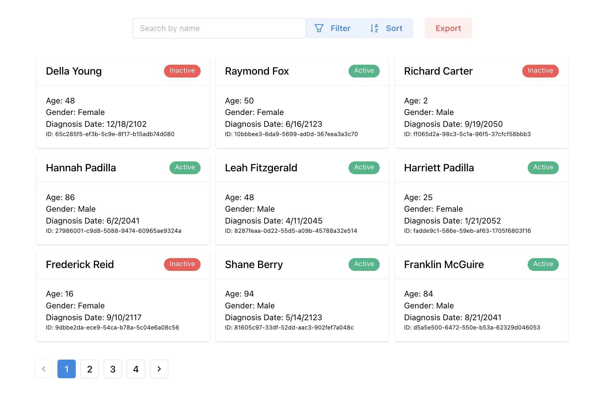
</center
>

### Table of Contents

- [Set Up](#set-up)
- [Development](#development)
  - [Start the development server](#start-the-development-server)
  - [Run linter](#run-linter)
  - [Run storybook](#run-storybook)
- [Deploy](#deploy)
- [Tooling](#tooling)
- [Implemented Functionalities](#implemented-functionalities)
  - [Filtering](#filtering)
  - [Sort by attributes (ascending)](#sort-by-attributes-ascending)
  - [Additional](#Additional)
- [Acknowledgement](#acknowledgement)

# Set Up

Clone the repository

```bash
git clone https://github.com/Zjjc123/vial-takehome.git
cd vial-takehome
```

Install dependencies

```bash
npm install
```

# Development

### Start the development server on http://localhost:5173/vial-takehome/

```bash
npm run dev
```

### Run linter

```bash
npm run lint
```

### Run storybook (isolated component development)

```bash
npm run storybook
```

<p float="left">
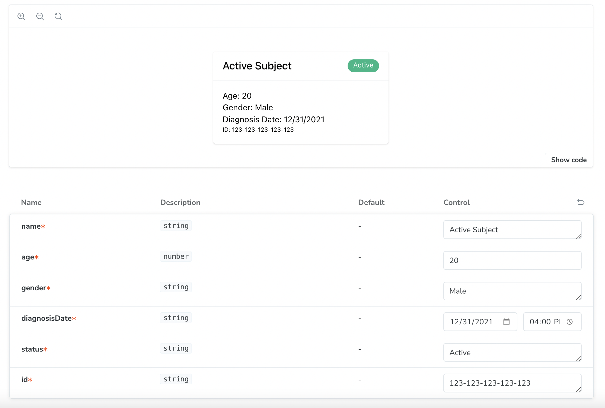
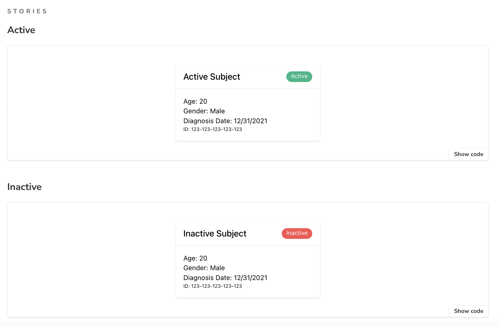
</p>

# Deploy

The app is deployed on GitHub Pages. The deployment is automated with GitHub Actions.

https://zjjc123.github.io/vial-takehome/

<center>
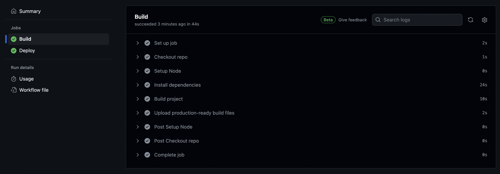
</center>

# Tooling

### Vite

I picked Vite (react typescript template) as the build tool for this project. It provides a faster development experience and better performance compared to CRA

### Mantine

I used Mantine for the UI components. It was recommended in the specs and I found it to be a great library with a lot of useful components like Menu and Inputs. It also has the theme feature which I used for the light/dark mode.

### Storybook

I used Storybook for isolated component development. It was very helpful in developing and testing the components individually.

# Implemented Functionalities

<center>
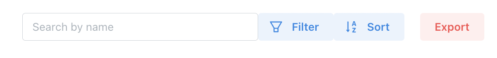
</center>

## Filtering

- Name (search bar)
- Age (range slider)
- Gender (dropdown)
- Diagnosis date (calendar range)
- Status (dropdown)

<center>
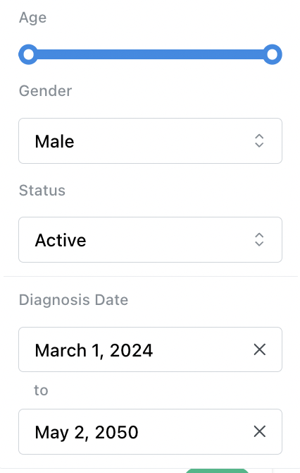
</center>

## Sort by attributes (ascending)

- Name
- Age
- Diagnosis Date

<center>
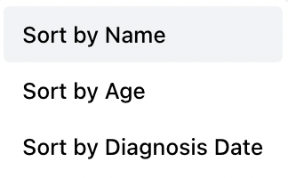
</center>

## Additional

### Pagination

<center>
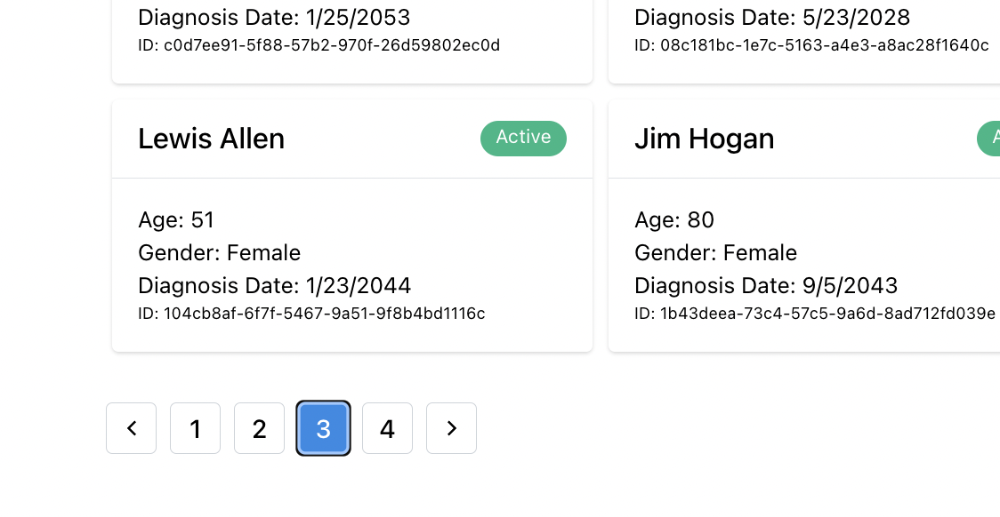
</center>

### Skeleton Cards and animated Loader on loading

<center>
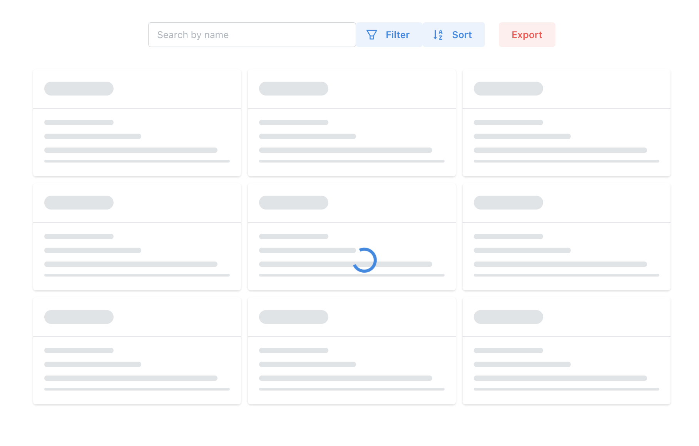
</center>

### Light/Dark mode with mantine

<p>
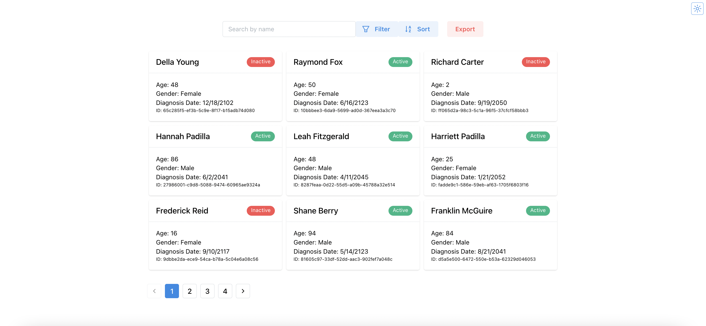
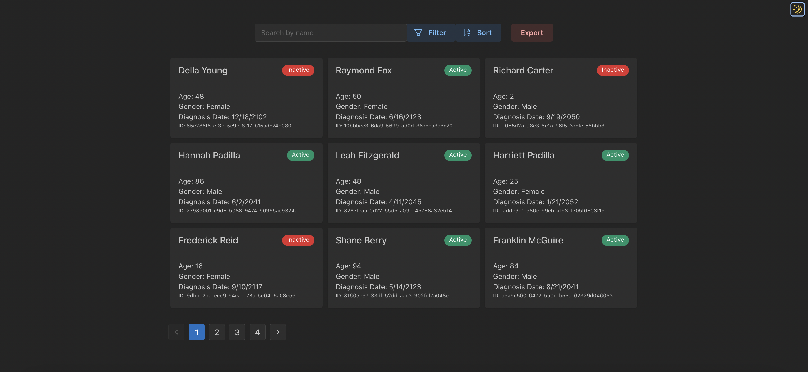
</p>

### Mobile accessibility (flexbox)

<center>
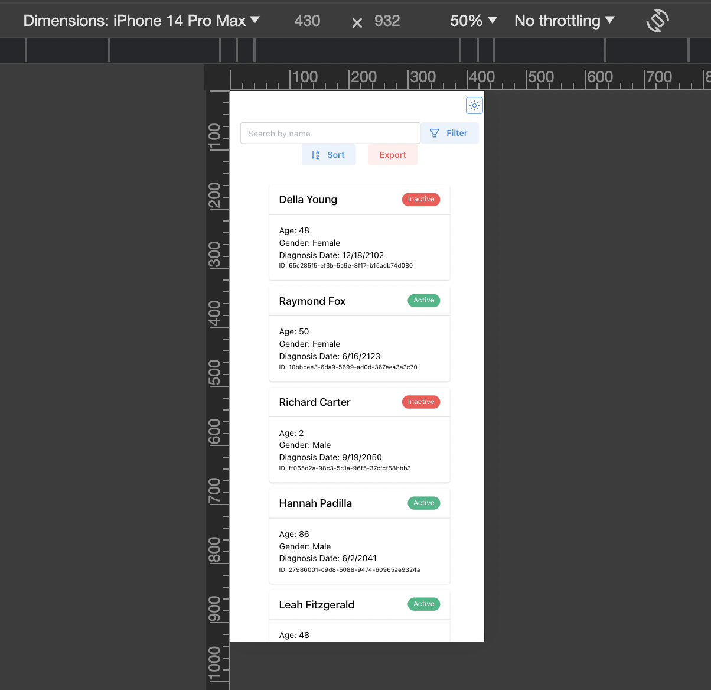
</center>

### Export selected data as json

Exporting Filtered Data (only Female)

<center>
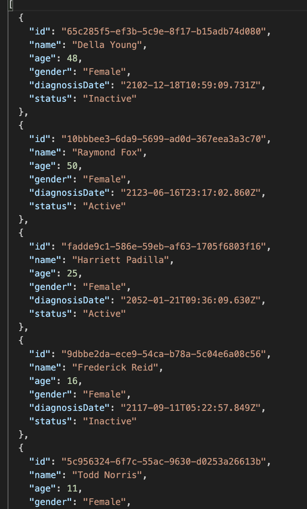
</center>

# Acknowledgement

- [Vite](https://vitejs.dev/)
- [Mantine](https://mantine.dev/)
- [Storybook](https://storybook.js.org/)

Thank you to the Vial team for this opportunity. I had a lot of fun working on this project. I look forward to hearing from you soon.

Jason Zhang 2024
